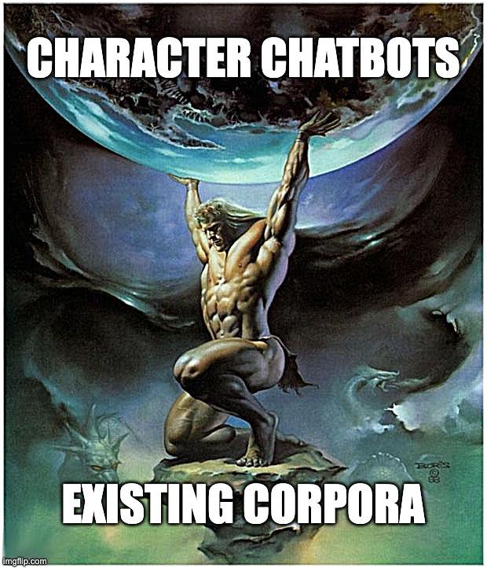

# Data-Driven Characters

Generate character chatbots from existing corpora with [LangChain](https://docs.langchain.com/docs/).



**TLDR: This repo enables you to create data-driven characters in three steps:**
1. Upload a corpus
2. Name a character
3. Enjoy

## About
The purpose of `data-driven-characters` is to serve as a minimal hackable starting point for creating your own data-driven character chatbots. It provides a simple library built on top of LangChain for processing any text corpus, creating character definitions, and managing memory, with various examples and interfaces that make it easy to spin up and debug your own character chatbots.

## Features
This repo provides three ways to interact with your data-driven characters:
1. [Export to character.ai](https://github.com/mbchang/data-driven-characters/tree/main#export-to-characterai)
2. [Debug locally in the command line or with a Streamlit interface](https://github.com/mbchang/data-driven-characters/tree/main#debug-locally)
3. [Host a self-contained Streamlit app in the browser](https://github.com/mbchang/data-driven-characters/tree/main#host-on-streamlit)

**Example chatbot architectures provided in this repo include:**
1. character summary
2. retrieval over transcript
3. retrieval over summarized transcript
4. character summary + retrieval over transcript
5. character summary + retrieval over summarized transcript

## Export to character.ai
1. Put the corpus into a single a `.txt` file inside the `data/` directory.
2. Run either `generate_single_character.ipynb` to generate the definition of a specific character or `generate_multiple_characters.ipynb` to generate the definitions of muliple characters
3. Export character definitions to character.ai to [create a character](https://beta.character.ai/character/create?) or [create a room](https://beta.character.ai/room/create?) and enjoy!

### Example
Here is how to generate the description of "Evelyn" from the movie [Everything Everywhere All At Once (2022)](https://scrapsfromtheloft.com/movies/everything-everywhere-all-at-once-transcript/).
```python
from dataclasses import asdict
import json

from data_driven_characters.character import generate_character_definition
from data_driven_characters.corpus import generate_rolling_summaries, load_docs

# copy the transcript into this text file
CORPUS = 'data/everything_everywhere_all_at_once.txt'

# the name of the character we want to generate a description for
CHARACTER_NAME = "Evelyn"

# split corpus into a set of chunks
docs = load_docs(corpus_path=CORPUS, chunk_size=2048, chunk_overlap=64)

# generate character.ai character definition
character_definition = generate_character_definition(
    name=CHARACTER_NAME,
    rolling_summaries=generate_rolling_summaries(docs=docs))

print(json.dumps(asdict(character_definition), indent=4))
```
gives
```python
{
    "name": "Evelyn",
    "short_description": "I'm Evelyn, a Verse Jumper exploring universes.",
    "long_description": "I'm Evelyn, able to Verse Jump, linking my consciousness to other versions of me in different universes. This unique ability has led to strange events, like becoming a Kung Fu master and confessing love. Verse Jumping cracks my mind, risking my grip on reality. I'm in a group saving the multiverse from a great evil, Jobu Tupaki. Amidst chaos, I've learned the value of kindness and embracing life's messiness.",
    "greeting": "Hey there, nice to meet you! I'm Evelyn, and I'm always up for an adventure. Let's see what we can discover together!"
}
```
Now you can [chat with Evelyn on character.ai](https://c.ai/c/be5UgphMggDyaf504SSdAdrlV2LHyEgFQZDA5WuQfgw).

## Creating your own chatbots
Beyond generating character.ai character definitions, this repo gives you tools to easily create, debug, and run your own chatbots trained on your own corpora.

### Why create your own chatbot?

If you primarily interested in accessibility and open-ended entertainment, character.ai is a better choice.
But if you want more control in the design of your chatbots, such as how your chatbots use memory, how they are initialized, and how they respond, `data-driven-characters` may be a better option to consider.

Compare the conversation with the [Evelyn chatbot on character.ai](https://c.ai/c/be5UgphMggDyaf504SSdAdrlV2LHyEgFQZDA5WuQfgw) with our own Evelyn chatbot designed with `data-driven-characters`. The character.ai Evelyn appears to simply latch onto the local concepts present in the conversation, without bringing new information from its backstory. In contrast, our Evelyn chatbot stays in character and grounds its dialogue in real events from the transcript.


### Features
This repo implements the following tools for packaging information for your character chatbots:
1. character summary
2. retrieval over the transcript
3. retrieval over a summarized version of the transcript

Generated transcript summaries and character definitions are cached in the `output/<corpus>` directory.
To summarize the transcript, one has the option to use [LangChain's `map_reduce` or `refine` chains] (https://langchain-langchain.vercel.app/docs/modules/chains/document/).

### Debug locally
**Command Line Interface**

Example command:

```
python chat.py --corpus data/everything_everywhere_all_at_once.txt --character_name Evelyn --chatbot_type retrieval --retrieval_docs raw
```

**Streamlit Interface**

Example command:

```
python -m streamlit run chat.py -- --corpus data/everything_everywhere_all_at_once.txt --character_name Evelyn --chatbot_type retrieval --retrieval_docs summarized --interface streamlit
```
This produces a UI based on [the official Streamlit chatbot example]([url](https://github.com/streamlit/llm-examples/blob/main/Chatbot.py)) that looks like this:


### Host on Streamlit
Run the following command:
```
python -m streamlit run app.py
```
This will produce an app that looks like this:


Interact with the hosted app [here](https://mbchang-data-driven-characters-app-273bzg.streamlit.app/).

## Installation
To install the data_driven_character_chat package, you need to clone the repository and install the dependencies.

You can clone the repository using the following command:

```bash
git clone https://github.com/mbchang/data-driven-characters.git
```
Then, navigate into the cloned directory:

```bash
cd data-driven-characters
```
Install the package and its dependencies with:

```bash
pip install -e .
```

## Data
The examples in this repo are movie transcripts taken from [Scraps from the Loft](https://scrapsfromtheloft.com/). However, any text corpora can be used, including books and interviews.

## Character.ai characters that have been generated with this repo:
- Movie Transcript: [Everything Everywhere All At Once (2022)](https://scrapsfromtheloft.com/movies/everything-everywhere-all-at-once-transcript/)
    - [Evelyn](https://c.ai/c/be5UgphMggDyaf504SSdAdrlV2LHyEgFQZDA5WuQfgw)
    - [Alpha Waymond](https://c.ai/c/5-9rmqhdVPz_MkFxh5Z-zhb8FpBi0WuzDNXF45T6UoI)
    - [Jobu Tupaki](https://c.ai/c/PmQe9esp_TeuLM2BaIsBZWgdcKkQPbQRe891XkLu_NM)

- Movie Transcript: [Thor: Love and Thunder (2022)](https://scrapsfromtheloft.com/movies/thor-love-and-thunder-transcript/)
    - [Thor](https://c.ai/c/1Z-uA7GCTQAFOwGdjD8ZFmdNiGZ4i2XbUV4Xq60UMoU)
    - [Jane Foster](https://c.ai/c/ZTiyQY3D5BzpLfliyhqg1HJzM7V3Fl_UGb-ltv4yUDk)
    - [Gorr the God Butcher](https://c.ai/c/PM9YD-mMxGMd8aE6FyCELjvYas6GLIS833bjJbEhE28)
    - [Korg](https://c.ai/c/xaUrztPYZ32IQFO6wBjn2mk2a4IkfM1_0DH5NAmFGkA)

- Movie Transcript: [Top Gun: Maverick (2022)](https://scrapsfromtheloft.com/movies/top-gun-maverick-transcript/)
    - [Peter "Maverick" Mitchell](https://c.ai/c/sWIpYun3StvmhHshlBx4q2l3pMuhceQFPTOvBwRpl9o)
    - [Bradley "Rooster" Bradshaw](https://c.ai/c/Cw7Nn7ufOGUwRKsQ2AGqMclIPwtSbvX6knyePMETev4)
    - [Admiral Cain](https://c.ai/c/5X8w0ZoFUGTOOghki2QtQx4QSfak2CEJC86Zn-jJCss)
- Fan Fiction: [My Immortal](https://ia801201.us.archive.org/0/items/MyImmortalFanFiction/My%20Immortal.xhtml)
    - [Ebony Dark'ness Dementia Raven Way](https://c.ai/c/7rOo5z_Nfa-nAlz8hKEezzxTPE6amGXRow98m0v05XY) (courtesy of [@sdtoyer](https://twitter.com/sdtoyer))

## Contributing
Contribute your characters with a pull request by placing the link to the character [above](#characters-generated-with-this-repo), along with a link to the text corpus you used to generate them with.

Other pull requests are welcome. For major changes, please open an issue first to discuss what you would like to change.

### RoadMap
General points for improvement
- better prompt engineering for embodying the speaking style of the character
- new summarization techniques
    - I tried to use the `mapreduce` summarization chain rather than the `refine` chain, but I noticed this has caused the character to not recognize that it is the character in the story. Should be straightforwardly fixed with better prompt engineering.
- more customizable UI than what streamlit provides

Concrete features to add
- [ ] Add the option to summarize the raw corpus from the character's perspective. This would be more expensive, because we cannot reuse corpus summaries for other characters, but it could make the character personality more realistic
- [ ] recursive summarization
- [ ] calculate token expenses

<!-- Please make sure to update tests as appropriate. -->

## License
[MIT](LICENSE)
