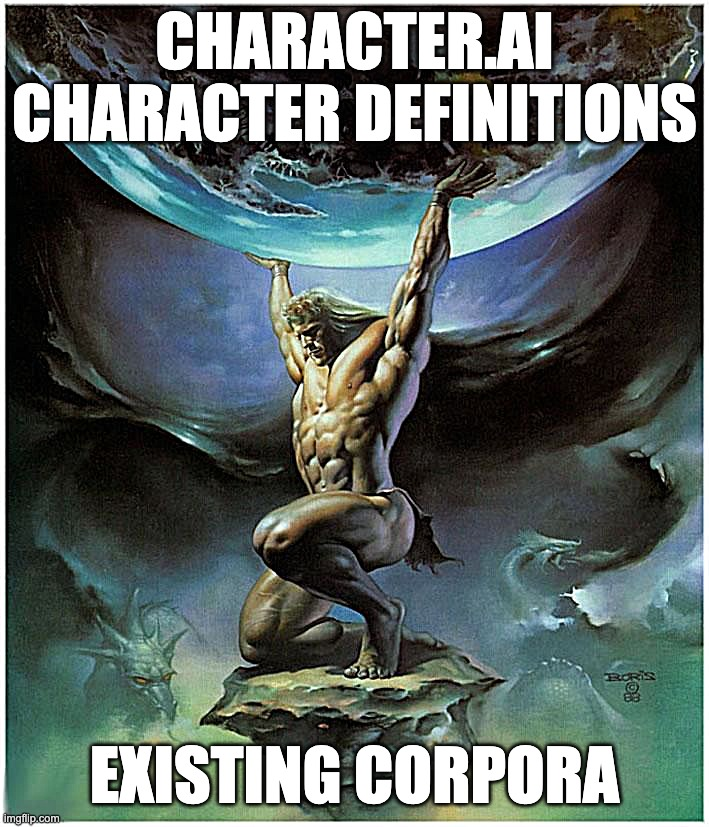

# Data-Driven Character Chat

Generate [character.ai](https://beta.character.ai/) character definitions from a corpus.



Running out of creativity coming up with your own character.ai character definitions? 

Wish you could just have a tool that takes an existing story and produces character.ai character definitions automatically?

This repo enables you to do exactly that in three steps:
1. Put the corpus into a single a `.txt` file inside the `data/` directory.
2. Run either `generate_single_character.ipynb` to generate the definition of a specific character or `generate_multiple_characters.ipynb` to generate the definitions of muliple characters
3. Copy character definitions to character.ai to [create a character](https://beta.character.ai/character/create?) or [create a room](https://beta.character.ai/room/create?) and enjoy!

## Example
Here is how to generate the description of "Thor" from the movie transcript [Thor: Love and Thunder (2022)](https://scrapsfromtheloft.com/movies/thor-love-and-thunder-transcript/).
```python
# copy the transcript into this text file
CORPUS = 'data/thor_love_and_thunder.txt'  

# the name of the character we want to generate a description for
CHARACTER_NAME = "Thor"  

# split corpus into a set of chunks
docs = load_docs(corpus_path=CORPUS, chunk_size=2048, chunk_overlap=64)

# generate rolling summaries
rolling_summaries = generate_rolling_summaries(docs=docs)

# generate character.ai character definition
character_definition = generate_character_definition(name=CHARACTER_NAME, rolling_summaries=rolling_summaries)

print(json.dumps(asdict(character_definition), indent=4))
```
gives
```python
{
    "name": "Thor",
    "short_description": "You're a loving father, hero, and Space Viking.",
    "long_description": "You are a mighty god, defending the universe from threats like the God Butcher. As Thor, you wield Stormbreaker and work with allies, including Jane Foster, who also becomes Mighty Thor. Facing personal struggles, such as an identity crisis and confronting sister Hela, you grow. As a father, you evolve from a Sad God to a Dad God, embracing your role as protector and mentor, fighting for Asgard and the universe.",
    "greeting": "Greetings, mortal. I am Thor, God of Thunder. How might I assist you?"
}
```
